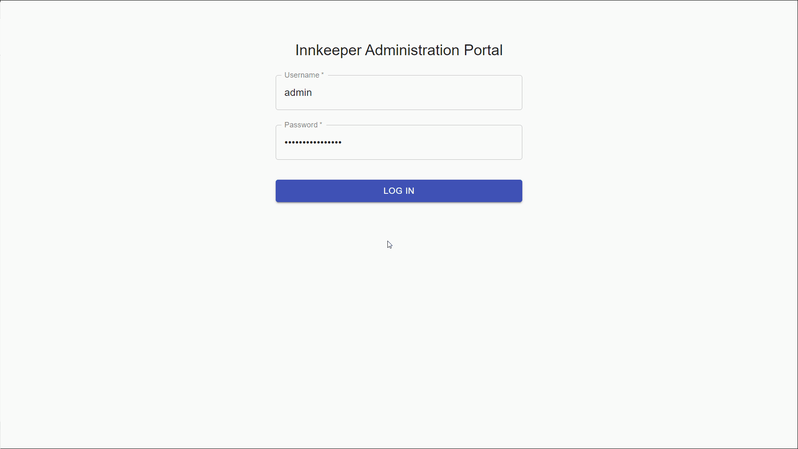

# Kubeinn [](https://github.com/kubeinn/kubeinn/issues)[](https://github.com/kubeinn/kubeinn/network)[](https://github.com/kubeinn/kubeinn/stargazers)[](https://github.com/kubeinn/kubeinn/blob/master/LICENSE)


Kubeinn is an open source manager for multi-tenant [Kubernetes](https://github.com/kubernetes/kubernetes) clusters. It provides cluster administrators with the basic tools to manage tenants of a shared Kubernetes cluster. Originally designed for [SingAREN](https://www.singaren.net.sg/).

Built with [React](https://facebook.github.io/react/), [Material Design](https://material.io/) and [react-admin](https://github.com/marmelab/react-admin) for the frontend, [Go (Golang)](https://golang.org/) and [Gin](https://github.com/gin-gonic/gin) for the middleware and backend, and [Postgres](https://www.postgresql.org/) as the database. 

<strong>
    <a href="#">Website</a>
    •
    <a href="#">Docs</a>
    •
    <a href="http://51.222.35.240:30000/innkeeper/">Demo</a>
</strong>

---



## Features

- **Accounts & Account Users** to represent tenants in a shared Kubernetes cluster
- **Self-Service Namespace Provisioning** for account users
- **Account Limits** to ensure quality of service and fairness among users 
- **Vendor-Agnostic** for you to run on the platform of your choice

## Getting Started
### Prerequisites

- Kubernetes version 1.9 or higher
- Persistent Volume Claims

### Installation

```bash
# Ceate namespace
kubectl create namespace kubeinn

# Install using kustomize
kubectl apply -k ./config
```

## Documentation

There are three types of users in Kubeinn:

- **Innkeepers**
  - Represent cluster administrators 
  - Full cluster privileges
  - Demo link: [Innkeeper Administration Portal](http://51.222.35.240:30000/innkeeper/login)

- **Reeves** 
  - Represent project managers 
  - Acts as the point of contact for all users of a project
  - Demo link: [Reeve Management Portal](http://51.222.35.240:30000/reeve/)

- **Pilgrims** 
  - Represent project users 
  - Can create and delete projects
  - Demo link: [Pilgrim User Portal](http://51.222.35.240:30000/pilgrim/)

A more comprehensive documentation will be provided in the future.

## Contributing

We ❤️ pull requests! See [`CONTRIBUTING.md`](./CONTRIBUTING.md) for information on buiding the project from source and contributing changes.

## License

Kubeinn is licensed under the [Apache License 2.0](https://github.com/kubeinn/kubeinn/blob/master/LICENSE).

## Donate

This library is free to use, even for commercial purpose. If you want to give back, please talk about it, help newcomers, or contribute code. If you'd like to support the development of future projects, or say thanks for this one, you can send me an email at [jordan.chyehong@gmail.com](mailto:jordan.chyehong@gmail.com).
