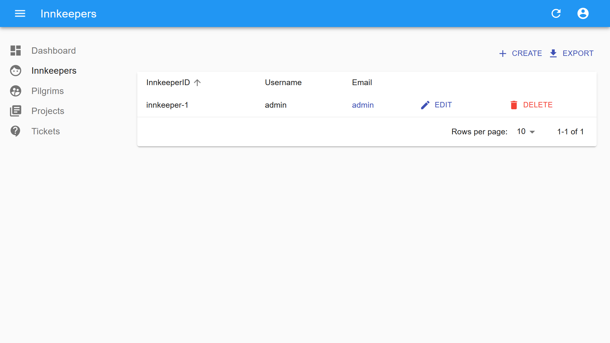
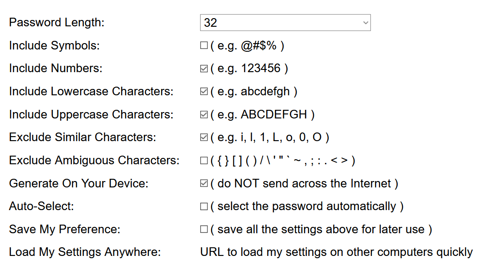

# Kubeinn [](https://github.com/kubeinn/kubeinn/issues)[](https://github.com/kubeinn/kubeinn/network)[](https://github.com/kubeinn/kubeinn/stargazers)[](https://github.com/kubeinn/kubeinn/blob/master/LICENSE)


Kubeinn is a cloud container service platform for multi-tenant [Kubernetes](https://github.com/kubernetes/kubernetes) clusters. It provides cluster administrators with the tools to manage a shared Kubernetes cluster with ease. 

Built with [React](https://facebook.github.io/react/), [Material Design](https://material.io/) and [react-admin](https://github.com/marmelab/react-admin) for the frontend, [Go (Golang)](https://golang.org/) and [Gin](https://github.com/gin-gonic/gin) for the middleware and backend, and [Postgres](https://www.postgresql.org/) as the database. 

<strong>
    <a href="https://kubeinn.github.io/kubeinn/">Website</a>
    •
    <a href="https://pkg.go.dev/github.com/kubeinn/kubeinn/src">Docs</a>
    •
    <a href="http://51.222.35.240:30000/">Demo</a>
</strong>

---



## Features
- Accounts & account users to represent tenants of a shared cluster
- Secure isolation between tenant namespaces
- Built-in authentication and authorization using JSON Web Tokens (JWTs)
- Self-service resource provisioning 
- Resource limits and quotas to ensure fair resource allocation 
- Vendor-agnostic to run on any platform of your choice
- Centralised resource control for the single source of truth for your cluster
- Simple ticketing service to raise requests (e.g. increase resource limits, CRDs etc.) 

## Installation
You can deploy Kubeinn on any Kubernetes 1.9+ cluster in a matter of minutes, if not seconds. 
### Prerequisites
- Kubernetes version 1.18 and above
- Persistent Volume Claims
### 1. Clone this repository
```bash
git clone https://github.com/kubeinn/kubeinn.git
cd kubeinn
```
### 2. Set kustomization secrets
You will need to create the environment files below and replace the values with 256 bit keys. 

```env
# ./configmaps/secrets/jwt-signing-key.env
POSTGRES_PASSWORD=[YOUR-256-BITS-POSTGRES-PASSWORD]
```

```env
# ./configmaps/secrets/jwt-signing-key.env
JWT_SIGNING_KEY=[YOUR-256-BITS-JWT-SIGNING-KEY]
```

Keys can be generated using [https://passwordsgenerator.net/](https://passwordsgenerator.net/).



### 3. Copy kube config
```bash
# kube config is usually located at /root/.kube/config
# May differ according to your cloud provider
cp /root/.kube/config config/configmaps/backend/admin-config
```
### 4. Create namespace
```bash
kubectl create namespace kubeinn
```
### 5. Install using kustomize
```bash
kubectl apply -k ./config
```

## Documentation
Refer to the [docs](https://kubeinn.github.io/kubeinn/) page.

## Contributing

We ❤️ pull requests! See [`CONTRIBUTING.md`](./CONTRIBUTING.md) for information on buiding the project from source and contributing changes.

## License

Kubeinn is licensed under the [Apache License 2.0](https://github.com/kubeinn/kubeinn/blob/master/LICENSE).

## Donate

This library is free to use, even for commercial purpose. If you want to give back, please talk about it, help newcomers, or contribute code. If you'd like to support the development of future projects, or say thanks for this one, you can send me an email at [jordan.chyehong@gmail.com](mailto:jordan.chyehong@gmail.com).
